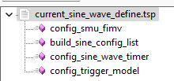
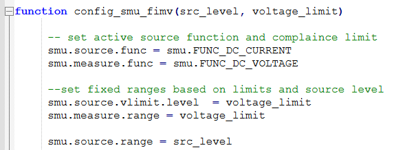
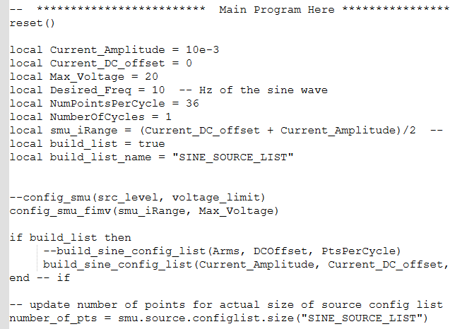
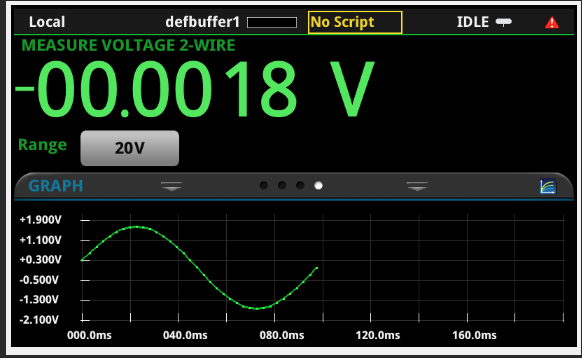
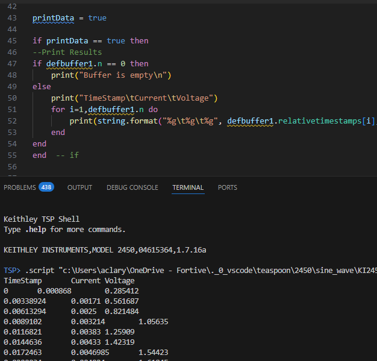

# Source Sine Wave of Current

This directory holds code examples for generation of a sine wave

## Directory

[comment]: **[Instrument](./directory)**  

* **[TSP Function Defining](./current_sine_wave_define.tsp)**  
This TSP file defines some helper functions for creation of a sine wave of current.

* **[TSP Function Using](./current_sine_wave_use.tsp)**  
This TSP file demos how to pass parameter values and use the sine wave generation functions.

## Code Walk Through

The Defining file contains instrumnet commands orgainized into functions.
When this file is run on the 2450, it may seem like nothing happened.
When running the code in this file, it loads the functions into runtime memory.
These functions are essentially your API for the task you need the 2450 to do.

Below is some detail of one of the functions.  It is defined to use paramters.
For example, the value of src_level is used to set the current source range.
The voltage_limit is used to set both the vlimit and the voltage measure range.

Below is part of the using TSP file.  It defines some variables and passes those values to the function.
It also can implement some conditional logic such as the if/then on build_list.
If you choose to move to Python or another programming language, this file approximates how
Python would make use of the defined functions.

Below shows the outcome when connected to a 330Ω resistor.
The TSP files can be brought to the instrument on a thumb drive.
Touch the screen where it displays 'No Script'.  This will give a pop-up list
of available scripts on thumb drive or stored on the instrument.
Run the current_sine_wave_define.tsp once.
Then run the current_sine_wave_use.tsp to generate the sine wave of current.
To run again without any value chnages, press TRIG button to execute it again.

The TSP code can also be run from TSP Toolkit extension for VSCode.
In this case, the data results can be spooled to the Terminal window of TSP Toolkit.

